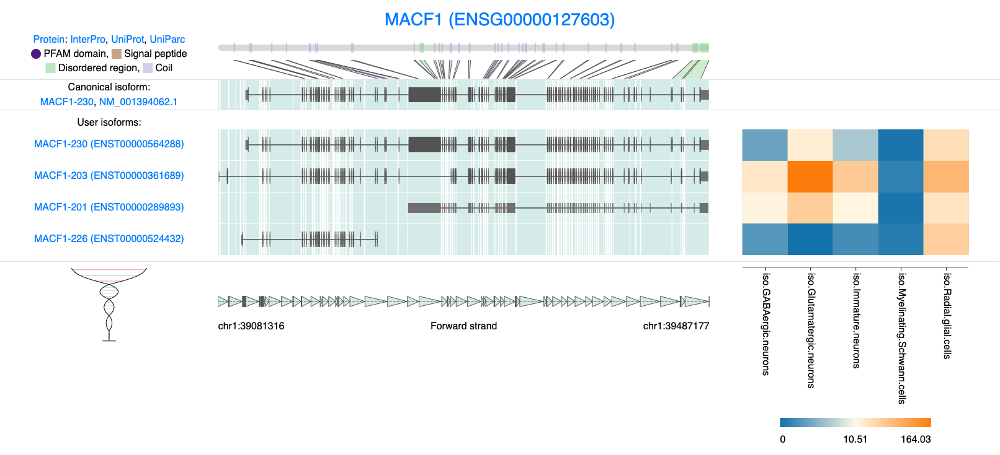

# **Exploring isoforms of interest**

One of the most powerful aspects of long-read single-cell sequencing is its ability to profile isoform-specific information at single-cell resolution. This capability opens up numerous avenues for analysis. In our lab we are interested in exploring the role of RNA isofroms in neuronal differentiation and there are many examples in the literate of isofroms regulating this process. We will cover some very general analysis with this focus in mind.

## Isoforms expressed per gene

With long-read single-cell data, we have the ability to analyze all the isoforms expressed by a given gene. In our data we can see that most genes express more than one isoform.

```{r, include=TRUE, echo=TRUE, warning=FALSE, warning=FALSE, fig.height=6, fig.width=6}

#lets aggeragte the expresstion data by cell type 
counts <- AggregateExpression(
  seu_obj, 
  assays = "iso", 
  return.seurat = FALSE,
  group.by = "sctype_db"
)

as.data.frame(counts) -> df
row.names(df) -> df$gene

#split transcript ids into gene and transcript id
pseudobulk_data <- df %>% separate(gene, into = c("transcript_id", "gene_id"), sep = "-",  extra = "merge") 
#df$transcript_id <- sub("\\..*", "", df$transcript_id)

# 2. Count the number of isoforms per gene
isoform_count_per_gene <- pseudobulk_data %>%
  group_by(gene_id) %>%
  summarise(n_isoforms = n_distinct(transcript_id))

# 3. count isforms per category 
isoform_count_per_gene <- isoform_count_per_gene %>%
  mutate(isoform_category = case_when(
    n_isoforms == 1 ~ "1",
    n_isoforms >= 2 & n_isoforms <= 3 ~ "2-3",
    n_isoforms >= 4 & n_isoforms <= 5 ~ "4-5",
    n_isoforms >= 6 ~ "6+"
  ))


# 4. Calculate the percentage of genes in each bin
isoform_count_summary <- isoform_count_per_gene %>%
  dplyr::count(isoform_category) %>%
  mutate(percent = (n / sum(n)) * 100)

ggplot(isoform_count_summary, aes(x = isoform_category, y = percent)) +
  geom_bar(stat = "identity", fill = "lightblue", color = "black") +  
  labs(title = "Number of Isoforms per Gene", 
       x = "Isoforms per Gene", 
       y = "Genes, %") +
  theme_minimal() +
  theme(legend.position = "none", 
        plot.title = element_text(hjust = 0.5))


```

## Top 10 Genes with Most Isoforms

We can see that about 45% of genes express a single isoform, however there are some genes like MIR9-1HG that have alot of unique isofroms, 97 in fact. The top 10 genes with the most isofroms are listed bellow.

```{r make_top10, include=TRUE, echo=TRUE, warning=FALSE}
# Genes ranked by the number of transcript isoforms detected across all samples 
gene_transcript_counts <- pseudobulk_data %>%
  group_by(gene_id) %>%
  summarise(unique_transcripts = n_distinct(transcript_id)) %>%
  arrange(desc(unique_transcripts))

# Select the top 10 genes based on unique transcript counts
top10 <- gene_transcript_counts %>% top_n(10, unique_transcripts)

top10
```

We can also plot unique transcripts per gene on a log scale showing that the number of isofroms per gene varies across out data.

```{r plot_unique_isoforms, include=TRUE, echo=TRUE, warning=FALSE}
# Plot ranked genes by unique "BambuTx" transcript count
ggplot(gene_transcript_counts, aes(x = rank(desc(unique_transcripts)), y = unique_transcripts)) +
  geom_point(color = "darkblue", size = 1) +  # Points for each gene

  # Log scale for both axes
  scale_x_log10() +
  scale_y_log10() +
  
  # Title and labels
  labs(
    title = "Unique Transcripts per Gene",
    x = "Rank (log scale)",
    y = "# Transcripts (log scale)"
  ) +
  
  # Highlight and label the top 10 genes with gray background and black border around the text
  geom_label_repel(
    data = gene_transcript_counts %>% filter(gene_id %in% top10$gene_id),
    aes(label = gene_id),
    fill = "gray",          # Gray background for the label
    color = "black",         # Black text color
    label.size = 0.25,       # Border thickness around the label
    label.r = unit(0.15, "lines"),  # Border radius (rounded corners)
    size = 3,
    box.padding = 0.2,
    max.overlaps = 14 
  ) +
  
  # Minimal theme and additional styling
  theme_minimal() +
  theme(
    plot.title = element_text(size = 14, face = "bold", hjust = 0.5), # Centered title
    axis.text = element_text(size = 10, color = "black"),             # Black axis tick labels
    axis.title = element_text(color = "black"),                       # Black axis titles
    panel.grid.minor = element_blank(),
    panel.border = element_rect(color = "black", fill = NA, linewidth = 1)  # Black border around the graph
  )

```

## Exploring MACF1 isoforms

We are interested in isoforms that regulate neuronal differentiation, we can look at some genes of interest. Lets look at gene *MACF1***.** This gene is know to.... [ref]. The gene seems to play some important role in neural migration which is not fully understood yet. First lets try and visualize the expression of these isofroms on a UMAP to see if we can uncover anything interesting. *MACF1* has 35 expressed isofroms so lets only plot the top 12 most highly expressed.

```{r plotting MACF1, include=TRUE, echo=TRUE, warning=FALSE, fig.height=10, fig.width=10 }
features <- rownames(filt_seurat_object@assays$iso@features)

# Define the gene of interest
gene <- "MACF1"

# Access the data matrix for the 'iso' assay
expression_matrix <- GetAssayData(filt_seurat_object, assay = "iso", slot = "data")

# Filter features containing the gene name
matching_features <- grep(paste0("(^|-|\\b)", gene, "($|\\b)"), rownames(expression_matrix), value = TRUE)

# Subset the expression matrix to include only the matching features
subset_expression <- expression_matrix[matching_features, , drop = FALSE]

# Calculate the total expression for each matching feature
total_expression <- Matrix::rowSums(subset_expression)

# Rank features by average expression
top_features <- names(sort(total_expression, decreasing = TRUE))

# Print the ranked features (optional)
print(data.frame(Feature = top_features, Expression = total_expression[top_features]))

options(repr.plot.width=12, repr.plot.height=12)
# Plot the top 16 features in descending order of their average expression
plots <- FeaturePlot(
  filt_seurat_object,
  features = head(top_features, 12),
  reduction = "umap",
  order = TRUE, # Ensures higher-expressing cells are plotted on top
  pt.size = 1)

# Adjust title size for each plot
plots <- lapply(plots, function(plot) {
  plot + theme(plot.title = element_text(size = 8))
})

# Combine the adjusted plots
CombinePlots(plots = plots, ncol = 3)

```

## Expression of MCAF1 isoforms Across Cell Types

Lets look at isofroms **ENST00000564288.6**, **ENST00000361689.7**, **ENST00000289893.8** and **ENST00000524432.5** in some more detail and plot the normalized expression of these isoforms across each cell type. We can see that the expression of **ENST00000524432.5** shows a cell type specific profile.

```{r vln MACF1, include=TRUE, echo=TRUE, warning=FALSE, fig.height=8, fig.width=10}
features_MACF1 <- c("ENST00000564288.6-MACF1", # cononical
                    "ENST00000361689.7-MACF1", # most cell types
                    "ENST00000289893.8-MACF1", # msot cell types
                    "ENST00000524432.5-MACF1") # radial glia

VlnPlot(seu_obj, features = features_MACF1, ncol = 2)
```

We can also show this enrichment with a dotplot.

```{r dot MACF1, include=TRUE, echo=TRUE, warning=FALSE}
dittoDotPlot(seu_obj, vars = features_MACF1, group.by = "sctype_db", scale = FALSE)

```

lets look at our DE results comparing Glutamatergic neurons and Radial glia cells that we calcualted in the previous chapter and filter for significant MCAF1 isoforms. If we plot these features on a Volcano plot we see isoform **ENST00000524432.5** is enriched in radial glia cells. In fact its enrichment compared to Glutamatergic neurons is pretty high with a Log2fold change of 4.16.

```{r DE_MACF1, include=TRUE, echo=TRUE, warning=FALSE}
glu_RG_iso %>%
  rownames_to_column("isoform") %>%
  filter(grepl("MACF1", isoform)) %>%
  filter(p_val_adj < 0.5) 

EnhancedVolcano(glu_RG_iso, lab=rownames(glu_RG_iso),
                x='avg_log2FC', y='p_val_adj',
                #selectLab= "VIM",
                pCutoff=0.05, FCcutoff=2,
                selectLab = "ENST00000524432.5-MACF1",
                boxedLabels = TRUE,
                drawConnectors = TRUE,
                title = "ENST00000524432.5-MACF1 is upregulated \n in Radial glial Cells compared to Glutamatergic Neurons")

```

## Visualization of Isoform Structures

Now that we know some MCAF1 isoforms expression is significantly different in these two cell populations it may be of interest to visualize the isoform structures. This analysis will help us explore the similarities and differences between our isoforms of interest.

There are many visualization options available to us and many of these are available in R. In fact FLAMES has its own visualization function `FLAMES::plot_isoform_reduced_dim`. This function is designed to work on single cell experiment object and not Seurat object. Although it is possible to switch between these formats, for the purpose of this tutorial we want to keep file conversations to a minimum to keep the analysis simple.

We instead recommend using IsoViz [@wan2024], which was developed in the Clark Lab. The tool is a web application specifically designed for visualizing isoform structures. This visualization can provide valuable insights into the potential functions of different isoforms.

First lets prepare the count data that we will load into Isoviz[^06_finding-isoforms-of-interest-1]

[^06_finding-isoforms-of-interest-1]: Please be careful when interpreting pseudubulk expression data. Although the data can give you some indication of relative expression across cell types, this numbers can be affected by the number of cells in each cluster.

```{r pseudo_save, include=TRUE, echo=TRUE, warning=FALSE}
#extract some isoform expression data to visualize in isoviz 
#use pseudobulk counts we from above  
row.names(df) <- NULL 
df$gene_id <- NULL

write.csv(df, "output_files/Pseudobulk_exp.csv", row.names = FALSE)

```

To use IsoViz click on the following link <https://isomix.org/isovis/> and uplaod the `isofrom_annotated.gtf` file located in the FLAMES output dir and `Pseudobulk_exp.csv` generated above. For more detail on how to use Isoviz click the '**IsoViz tutorial**' button or read the publication.

Embedded bellow is the figure generated by Isoviz[^06_finding-isoforms-of-interest-2]. Here we and visualizing our 4 isofroms of interest. We can see MCAF1 is a very complex gene with many exons, a variety of alternative transcription start sites. Structural visualization aids in identifying critical variations such as alternative splicing events, unique protein-coding regions, and functional domains.

[^06_finding-isoforms-of-interest-2]: When Viewing this data in the web browser users will have more functionality. This includes a zoom function, looking at protein domains and rearranging isoform tracks and known visualizing open reading frames.

```{r isoviz-plot, fig.cap="IsoViz visualization of 4 MACF1 isoforms.", out.width="1600px", fig.height=5, fig.width=10}

```

Our pseudobulk expression data clearly demonstrates that **ENST00000524432.5** is predominantly expressed in radial glia cells. This isoform is particularly interesting, as it is significantly shorter than others and lacks many of the protein domains present in **ENST00000564288.6** (the canonical isoform). Notably, all four isoforms exhibit different transcription start sites (TSS), suggesting that TSS variation may be linked to cell-type-specific expression or distinct proteaforms

For example, **ENST00000289893.8** shows comparably high expression levels across most cell types. However, a deeper exploration of this isoform reveals that it does not produce a functional protein. This is evident from examining the **Ensembl** data, accessible via the isoform hyperlink, where we can see that no open reading frames (ORFs) are associated with this transcript.

There are lots of additional analysis that could be performed to further explore the function of our *MCAF1* isofroms, these include domain enrichment analysis and protein folding to name a few.
