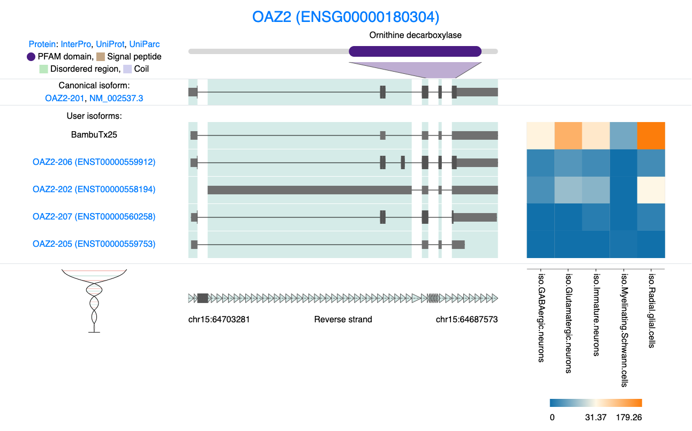
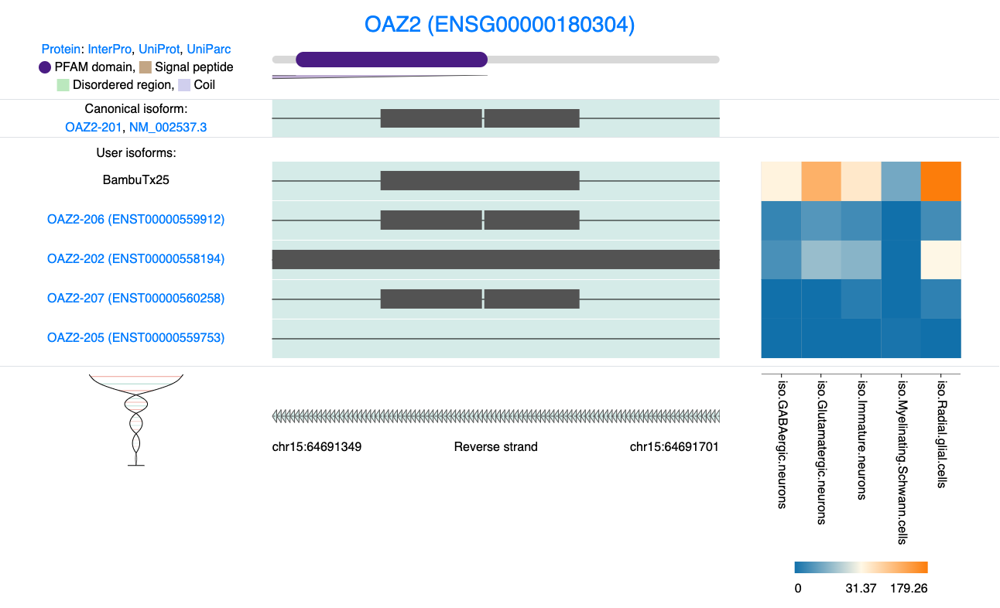
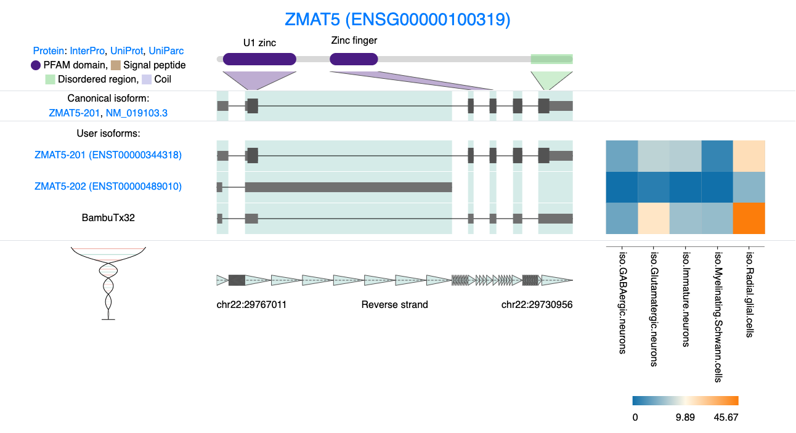

# **Isoform Classification**

## Classification with SQANTI

In the previous Chapter we looked at some genes of interst like MCAF1 and some of the isoforms related to this gene. As you can see MCAF1 is a highly complex gene with many exons, varied Transcription strat sites and many splice junctions. Evaluating this information manually for each isoform is complex and time consuming. A tool that that is very useful here is SQANTI3 [@pardo-palacios2024] which will categorize our isoforms[^07-isofrom-classification-1] and determine whether they are coding or non-coding.

[^07-isofrom-classification-1]: For more detail about the classification system see the SQANTI publication.

If you install SQANTI3 and run the following command in your FLAMES output folder you will generate a `classifications.txt` file. This output file is located in the data folder on the github page. SQANTI can also generate an HTML report with lots of figures summarizing your isoforms which can be very helpful. We will do something similar but instead plot this information stratified by cell type.

```{bash, eval=FALSE, include=TRUE, echo=TRUE}
GTF="gencode.v47.annotation.gtf" 
genome="genome.fa"
#filter gtf file to remove annoatiuon of unknown strands
awk '$7 == "+" || $7 == "-"' isoform_annotated.gtf > remove_unknownstrand.gtf
#run SQANTIpython3 
#you may need need to activate a conda enviroment 
SQANTI3-5.2.1/sqanti3_qc.py remove_unknownstrand.gtf ${GTF} ${genome}
```

If we examine the classifications file, we can see that each isoform in our `GTF` file has been categorized based on its structural characteristics, coding potential, and additional attributes.

```{r SQANTI, include=TRUE, echo=TRUE, warning=FALSE}
SQANTI <- read.csv("data/remove_unknownstrand_classification.txt", sep ='\t')
#SQANTI$isoform <- sub("\\..*", "", SQANTI$isoform) # remove numbers after . 

head(SQANTI, 3)

```

There is a lots information one can extract from the `classifications.txt` file. to get a more complete picture of the isoforms in the sample Lets plot some of this information.

```{r SQANTI_plots, include=TRUE, echo=TRUE, warning=FALSE, fig.height=10, fig.width=16}

#we can use the pseudobulk_data counts calculated previously 
# Select cell type columns and gather into long format
long_data <- pseudobulk_data %>%
  pivot_longer(
    cols = starts_with("iso."),
    names_to = "cell_type",
    values_to = "expression"
  )

# Filter for non-zero expression to identify genes and isoforms expressed in each cell type
filtered_data <- long_data %>%
  filter(expression > 0) %>%
  dplyr::select(cell_type, transcript_id, gene_id) %>%
  distinct()

# Calculate unique gene and isoform counts for each cell type
cell_type_summary <- filtered_data %>%
  group_by(cell_type) %>%
  summarise(
    num_genes = n_distinct(gene_id),
    num_isoforms = n_distinct(transcript_id)
  ) %>%
  pivot_longer(cols = c(num_genes, num_isoforms), 
               names_to = "Category", 
               values_to = "Count")

# Plot the data
p1 <- ggplot(cell_type_summary, aes(x = cell_type, y = Count, fill = Category)) +
  geom_bar(stat = "identity", position = "dodge", color = "black", width = 0.8) +
  theme_minimal() +
  labs(title = "Number of genes and isoforms \n per cell type",
       x = "Cell Type",
       y = "Count") +
  theme(
    plot.title = element_text(size = 20, face = "bold", hjust = 0.5),
    axis.title.x = element_text(size = 14),
    axis.title.y = element_text(size = 14),
    axis.text.x = element_text(size = 12, angle = 45, hjust = 1),
    axis.text.y = element_text(size = 12),
    legend.title = element_blank()
  )


# plot the structural category per cell type
  merged_data <- merge(pseudobulk_data, SQANTI, 
                     by.x = "transcript_id", 
                     by.y = "isoform", 
                     all.x = TRUE)
 
  # Pivot pseudobulk data to long format for cell types
long_data <- merged_data %>%
  pivot_longer(
    cols = starts_with("iso."),
    names_to = "cell_type",
    values_to = "expression"
  )

# Generate outr new df thatw e can use for plotting attributes deffiend by cell type
filtered_data <- long_data %>%
  filter(expression > 0) %>%
  distinct()

# Calculate unique counts of genes and isoforms per structural category and cell type
category_summary <- filtered_data %>%
  group_by(cell_type, structural_category, subcategory, coding) %>%
  summarise(
    num_genes = n_distinct(gene_id),
    num_isoforms = n_distinct(transcript_id),
    .groups = "drop"
  )

# Plot number of isoforms per structural category for each cell type
p2 <- ggplot(category_summary, aes(x = cell_type, y = num_isoforms, fill = structural_category)) +
  geom_bar(stat = "identity", position = "stack", width = 0.8) +
  theme_minimal() +
  labs(
    title = "Isoforms by structural category \n across cell types",
    x = "Cell Type",
    y = "Number of Isoforms",
    fill = "Structural Category"
  ) +
  theme(
    plot.title = element_text(size = 20, face = "bold", hjust = 0.5),
    axis.title.x = element_text(size = 14),
    axis.title.y = element_text(size = 14),
    axis.text.x = element_text(size = 12, angle = 45, hjust = 1),
    axis.text.y = element_text(size = 12),
    legend.title = element_text(size = 14),
    legend.text = element_text(size = 12)
  )

p3 <- ggplot(category_summary, aes(x = cell_type, y = num_isoforms, fill = subcategory)) +
  geom_bar(stat = "identity", position = "stack", width = 0.8) +
  theme_minimal() +
  labs(
    title = "Isoforms by structural subcategory \n across cell types",
    x = "Cell Type",
    y = "Number of Isoforms",
    fill = "subcategory"
  ) +
  theme(
    plot.title = element_text(size = 20, face = "bold", hjust = 0.5),
    axis.title.x = element_text(size = 14),
    axis.title.y = element_text(size = 14),
    axis.text.x = element_text(size = 12, angle = 45, hjust = 1),
    axis.text.y = element_text(size = 12),
    legend.title = element_text(size = 14),
    legend.text = element_text(size = 12)
  )


p4 <- ggplot(category_summary, aes(x = cell_type, y = num_isoforms, fill = coding)) +
  geom_bar(stat = "identity", position = "fill", width = 0.8) +
  theme_minimal() +
  labs(
    title = "Proportion of coding isoforms \n across cell types",
    x = "Cell Type",
    y = "Proportion of Isoforms",
    fill = "Structural Category"
  ) +
  scale_y_continuous(labels = scales::percent) +  # This will show y-axis as percentages
  theme(
    plot.title = element_text(size = 20, face = "bold", hjust = 0.5),
    axis.title.x = element_text(size = 14),
    axis.title.y = element_text(size = 14),
    axis.text.x = element_text(size = 12, angle = 45, hjust = 1),
    axis.text.y = element_text(size = 12),
    legend.title = element_text(size = 14),
    legend.text = element_text(size = 12)
  )


#Plots

cowplot::plot_grid(p1, p2, p3, p4, ncol = 2)

```

## Cell type specific isoforms

We can also look at isoforms that are unique to each Cell type. We define unique as an isofroms that has 5 or more counts in one cell type and ≤ 1 count in all other cell types. Users can adjust the thresholds mentioned bellow[^07-isofrom-classification-2].

[^07-isofrom-classification-2]: It is essential to keep in mind that cell type classification, sequencing depth, and the number of cells in each cluster can significantly impact the results, especially in cases where isoforms are expressed at very low levels.

```{r uniq_isofrom, include=TRUE, echo=TRUE, warning=FALSE, fig.height=6, fig.width=6}
# Filter the data based on the expression cutoff
# Set expression cutoff threshold
expression_cutoff <- 5
max_expression_in_all_other_cells_types = 1

# Filter isoforms based on the new criteria
exclusive_isoforms <- long_data %>%
  group_by(transcript_id) %>%
  filter(
    # Only one cell type where expression > cutoff
    sum(expression > expression_cutoff) <= 1,
    # Ensure all other cell types have 0 expression
    all(expression < max_expression_in_all_other_cells_types | expression > expression_cutoff)
  ) %>%
  ungroup()

# Count the unique isoforms per cell type
# Adjust counting logic
exclusive_isoforms_count <- exclusive_isoforms %>%
  group_by(cell_type) %>%
  summarise(
    unique_isoforms = sum(expression > expression_cutoff)  # Count only isoforms with valid expression
  ) %>%
  ungroup()

# Plot the results
ggplot(exclusive_isoforms_count, aes(x = cell_type, y = unique_isoforms, fill = cell_type)) +
  geom_bar(stat = "identity", color = "black", width = 0.8) +
  theme_minimal() +
  labs(
    title = "Number of isoforms unique \n to each cell type",
    x = "Cell Type",
    y = "Number of Unique Isoforms"
  ) +
  theme(
    plot.title = element_text(size = 20, face = "bold", hjust = 0.5),
    axis.title.x = element_text(size = 14),
    axis.title.y = element_text(size = 14),
    axis.text.x = element_text(size = 12, angle = 45, hjust = 1),
    axis.text.y = element_text(size = 12),
    legend.title = element_blank()
  )


```

These cell type specific isoforms may be particularly interesting to study further, as they likely play important roles in differentiation and cell function. We could extract these isoforms for further analysis.\
Lets use another helpful resource to explore these cell type specific isofroms.

We can use the BioMart [@smedley2009] package to get some more metadata about each isoform. There is lots of data that can be extracted from BioMart. This is just a simple example of what can be done with this cell type specif data.

```{r Glut_specific, include=TRUE, echo=TRUE, warning=FALSE, fig.height=14, fig.width=5}

library("biomaRt")

exclusive_isoforms_uniq <- exclusive_isoforms %>%
  filter(expression >= max_expression_in_all_other_cells_types) %>%
  arrange(desc(expression))

exclusive_isoforms_uniq$transcript_id <- sub("\\..*", "", exclusive_isoforms_uniq$transcript_id)

# Retrieve gene biotype from Ensembl
  mart <- useMart(biomart = "ensembl", 
                 dataset = "hsapiens_gene_ensembl") 
  
  biotype_info_transcript <- getBM(attributes = c("ensembl_transcript_id", "transcript_is_canonical", 'transcript_biotype', 'transcript_length'),
                                   filters = 'ensembl_transcript_id',
                                   values = exclusive_isoforms_uniq$transcript_id,
                                   mart = mart)
  
  #merge excluive isofroms and biomart data togehter 
  merged_biomart_data <- merge(exclusive_isoforms_uniq, biotype_info_transcript, 
                     by.x = "transcript_id", 
                     by.y = "ensembl_transcript_id", 
                     all.x = TRUE)
  
# Prepare the summary data
category_summary <- merged_biomart_data %>%
  group_by(cell_type, transcript_biotype) %>%
  summarise(num_isoforms = n(), .groups = "drop") %>%
  group_by(cell_type) %>%
  mutate(proportion = num_isoforms / sum(num_isoforms)) %>%
  ungroup()

# Ensure consistent factor order for cell_type and transcript_biotype
# Ensure consistent factor order for cell_type and transcript_biotype
category_summary <- category_summary %>%
  mutate(
    cell_type = factor(cell_type, levels = unique(cell_type)),
    transcript_biotype = factor(transcript_biotype, levels = c(
      "protein_coding", 
      "lncRNA", 
      "non_stop_decay",
      "TEC",
      "nonsense_mediated_decay",
      "protein_coding_CDS_not_defined",
      "retained_intron",
      "processed_pseudogene",
      "snoRNA",
      "transcribed_processed_pseudogene"
    ))
  )

# Create the plot 
p5 <- ggplot(category_summary, aes(x = cell_type, y = proportion, fill = transcript_biotype)) +
  geom_bar(stat = "identity", position = "fill", width = 0.8) +
  geom_text(aes(label = scales::percent(proportion, accuracy = 0.1)), 
            position = position_fill(vjust = 0.5), size = 2) +
  theme_minimal() +
  labs(
    title = "BioMart Structural Categories \n cell specific isoforms",
    x = "Cell Type",
    y = "Proportion of Isoforms",
    fill = "BioMart structual Category"
  ) +
  scale_y_continuous(labels = scales::percent) +
  theme(
    plot.title = element_text(size = 18, face = "bold", hjust = 0.5),
    axis.title.x = element_text(size = 12),
    axis.title.y = element_text(size = 12),
    axis.text.x = element_text(size = 12, angle = 45, hjust = 1),
    axis.text.y = element_text(size = 12),
    legend.title = element_text(size = 10),
    legend.text = element_text(size = 6)
  )

p6 <- ggplot(merged_biomart_data, aes(x = cell_type, y = transcript_length, fill = cell_type)) +
  geom_violin(trim = TRUE, alpha = 0.6) +  # Use violin plot for distribution
  geom_boxplot(width = 0.1, outlier.size = 0.5, alpha = 0.8) +  # Add boxplot for summary statistics
  theme_minimal() +
  labs(
    title = "Transcript length distribution \n across cell types",
    x = "Cell Type",
    y = "Transcript Length (nt)",
    fill = "Cell Type"
  ) +
  theme(
    plot.title = element_text(size = 18, face = "bold", hjust = 0.5),
    axis.title.x = element_text(size = 10),
    axis.title.y = element_text(size = 10),
    axis.text.x = element_text(size = 12, angle = 45, hjust = 1),
    axis.text.y = element_text(size = 12),
    legend.position = "none"
  )

cowplot::plot_grid(p5, p6, ncol = 1)
```

# **Novel isofroms**

With long read sequencing its possible to explore both known and novel isofroms. Novel isoform can be interesting feature to explore and here we will provide some simple analysis that one can use to extract novel isoforms and explore them in some more detail. Although the bar plots above show that the vast majority of isofroms are full-splice-matches i.e they match the reference `GTF` there are a few we could extract.

## Find all the genes that express at least 1 novel isoform

First lets get a list of genes with at least one novel isoform

```{r atleast_1_novel_isoform, include=TRUE, echo=TRUE, warning=FALSE}
# Find the genes that express at least one novel isoform and save them to a list
# Convert row names to a data frame
isoform_ids <- as.data.frame(row.names(seu_obj@assays$iso$counts))
colnames(isoform_ids) <- "IDs"

#Add in total expression  
isoform_ids$Total_Expression <- rowSums(seu_obj@assays$iso$counts)

# Filter rows where 'IDs' contains the string "Bambu"
isoform_ids <- as.data.frame(isoform_ids[grepl("Bambu", isoform_ids$IDs), ])  # can comment this out if we want to do this for all isofroms 

# Separate the 'IDs' column into two columns 
filtered_df <- isoform_ids %>% separate(IDs, into = c("transcript_id", "gene_id"), sep = "-",  extra = "merge")

isoform_counts <- filtered_df %>%
  group_by(gene_id) %>%
  summarise(
    Isoform_Count = n(),
    Total_Expression = sum(Total_Expression)
  ) %>%
  arrange(desc(Total_Expression))


# Print or return the filtered data frame
print(isoform_counts)
```

In this table we can see that we have a total of 31 novel isofroms. This number is smaller than we might expect but this is because Bambu [@chen2023] is quite conservative for single cell data and we haven't sequenced these data very deeply. Users can change the sensitivity of Bambu when running FLAMES by setting the `NDR` parameter or using a different discovery method like stringtie2 [@kovaka2019].

In the above table we have ordered the the genes that contain a novel isoform by total expression. OAZ2 is our top hit. We can look at the isoform structure using IsoViz as described in the section \@ref(visualization-of-isoform-structures).

```{r isoviz-plot2, fig.cap="IsoViz visualization of Novel OAZ2 isoform.", out.width="1000px"}

```

## Visualizing OAZ2 novel isoform

Visualizing **OAZ2** reveals that the primary distinction between the novel isoform and the canonical isoform, **OAZ2-201** seems to be a shorter 5' UTR. This minor alteration at face value should not affect the canonical open reading frame (ORF). However, according to SQANTI, **BambuTx25** is classified as a ***novel_in_catalog*** isoform, meaning it is an isoform not present in the reference GTF and SQANTI suggests that **BambuTx25** is non-coding, which is quite surprising! Interestingly, SQANTI also indicates that the primary difference between **BambuTx25** and the canonical isoforms lies in intron retention (Specified in the *subcategory* column).

```{r , include=TRUE}
# Load necessary libraries
SQANTI[grep('BambuTx25', SQANTI$isoform), ]
```

To better understand these SQANTI results lets zoom in on exon 2 of *OAZ2*. Here, we observe a small break within the exon. The novel **BambuTx25** does not contain this break so perhaps this change affects the resulting amino acid sequence.

```{r isoviz-plot-zoom, fig.cap="IsoViz visualization of exon 2 of OAZ2.", out.width="1000px"}

```

## Functional impacts of novel isoforms

There are many ways to investigate the translated sequence and compare the protein generated from conanocial isoform and the novel one. Simple approaches may involve extracting the fasta sequence and looking for the open reading frames (ORFs) in a online tool like 'expasy translate' which can be found here <https://web.expasy.org/translate/>.

Bellow we have written a function that will take a list of isoforms from a gene and plot the ORFs as defined by the package ORFik[^07-isofrom-classification-3] [@tjeldnes2021]. We will visualize these ORFS in Gviz [@hahne2016] an R package for visualizing genomic features. This analysis will help us determine if the ORF in the transcript **BambuTx25** has been impacted by the change in nucleotide sequence.

[^07-isofrom-classification-3]: ORFs found by the package ORFik may need to be filtered based on length or position when analysising differnt genes or isoforms.

```{r ORFS-plot3, include=TRUE, echo=TRUE, warning=FALSE, message=FALSE,fig.height=6, fig.width=12}
invisible(library(ORFik))
invisible(library(GenomicFeatures))
invisible(library(Gviz))
library(BSgenome.Hsapiens.UCSC.hg38)

# Global cache for TxDb
txdb_cache <- list()

get_txdb <- function(reference_gtf) {
  # Check if the TxDb for this file is already in cache
  if (!is.null(txdb_cache[[reference_gtf]])) {
    message("Using cached TxDb...")
    return(txdb_cache[[reference_gtf]])
  }
  
  # Create TxDb and cache it
  message("Creating TxDb object from reference GTF. This may take time...")
  txdb <- txdbmaker::makeTxDbFromGFF(reference_gtf)
  txdb_cache[[reference_gtf]] <<- txdb
  return(txdb)
}

plot_isoform_ORFs <- function(reference_gtf, target_gtf, isoforms_of_interest, 
                               chromosome, plot_start, plot_end) {
  
  # Load genome reference
  genomedb <- BSgenome.Hsapiens.UCSC.hg38

  # Retrieve cached TxDb or create if not available
  txdb <- get_txdb(reference_gtf)
  
  # Import and filter GTF for specific isoforms
  gtf_data <- import(target_gtf)
  gtf_filtered <- gtf_data[gtf_data$transcript_id %in% isoforms_of_interest]
  txdb_filtered <- txdbmaker::makeTxDbFromGRanges(gtf_filtered)
  
  # Extract exons and convert to GRangesList
  txs <- exonsBy(txdb_filtered, by = c("tx", "gene"), use.names = TRUE)
  txs_grl <- GRangesList(txs)
  
  # Extract transcript sequences and identify ORFs
  tx_seqs <- extractTranscriptSeqs(genomedb, txs_grl)
  ORFs <- findMapORFs(txs_grl, tx_seqs, groupByTx = FALSE, 
                       longestORF = FALSE, minimumLength = 30, 
                       startCodon = "ATG", stopCodon = stopDefinition(1))
  
  # Unlist and prepare ORF data for plotting
  ORFs_unlisted <- unlist(ORFs)
  ORFs_unlisted$type <- "exon"
  ORFs_unlisted$transcript <- ORFs_unlisted$names
  ORFs_unlisted$transcript <- paste0(ORFs_unlisted$transcript, "_ORF")

  # Define start and stop codons
  starts <- startCodons(ORFs, is.sorted = TRUE)
  stops <- stopCodons(ORFs, is.sorted = TRUE)
  
  # Visualization Tracks
  gtrack <- GenomeAxisTrack()
  itrack <- IdeogramTrack(genome = "hg38", chromosome = chromosome)
  
  ref_track <- GeneRegionTrack(
    range = txdb,
    name = "gencodev47",
    genome = "hg38",
    chromosome = chromosome,
    col = "darkblue",
    fill = "lightblue",
    arrowHead = FALSE
  )
  
  input_track <- GeneRegionTrack(
    range = txdb_filtered,
    name = "Isoforms (Exons)",
    genome = "hg38",
    chromosome = chromosome,
    col = "darkgreen",
    fill = "lightgreen",
    arrowHead = FALSE
  )
  
  orf_track <- GeneRegionTrack(
    ORFs_unlisted,
    genome = "hg38",
    chromosome = unique(seqnames(ORFs_unlisted)),
    transcriptAnnotation = "transcript",
    name = "ORFs",
    col = "grey",
    fill = "grey",
    stacking = "squish"
  )
  
  starts_track <- AnnotationTrack(
    range = starts,
    name = "Starts",
    genome = "hg38",
    chromosome = seqnames(txs_grl[[1]])[1],
    col = "green",
    fill = "green",
    shape = "box"  # Ensure no arrows by using box shape
  )
  
  stops_track <- AnnotationTrack(
    range = stops,
    name = "Stops",
    genome = "hg38",
    chromosome = seqnames(txs_grl[[1]])[1],
    col = "red",
    fill = "red",
    shape = "box"  # Ensure no arrows by using box shape
  )
  
  # Plot tracks
  plotTracks(list(itrack, gtrack, ref_track, input_track, 
                   orf_track, stops_track, starts_track), 
             from = plot_start, to = plot_end, 
             transcriptAnnotation = "transcript")
}

# Example usage
plot_isoform_ORFs(
  reference_gtf = "../../../../resources/gencode.v47.annotation.gtf",
  target_gtf = "/data/scratch/users/yairp/FLAMES_Day55/outs/isoform_annotated_unfiltered.gtf",
  isoforms_of_interest = c("ENST00000326005.10", "BambuTx25"),
  chromosome = "chr15",
  plot_start = 64687015,
  plot_end = 64703412
)

plot_isoform_ORFs(
  reference_gtf = "../../../../resources/gencode.v47.annotation.gtf",
  target_gtf = "/data/scratch/users/yairp/FLAMES_Day55/outs/isoform_annotated_unfiltered.gtf",
  isoforms_of_interest = c("ENST00000326005.10", "BambuTx25"),
  chromosome = "chr15",
  plot_start = 64691416,
  plot_end = 64691685
)


```

Visualizing ORFs using the above code chunck shows that the **BambuTx25_1\_ORF** is incomplete. The additional sequence (retained intron as specified by SQANTI) results in a premature stop codon shown in red which likely triggers nonsense-mediated decay (NMD). The canonical ENST00000326005.10_3\_ORF is complete.

We can examine additional genes from our list. For instance, **ZMAT5** has a novel isoform that utilizes a different, known splice junction in the 5' UTR. Using the function above to examine ORFs, we can see that the ORF is unchanged compared to the canonical isoform. This may suggest some import regulatory role in the 5' UTR yet the protein remains unchanged.

```{r isoviz-plot3, fig.cap="IsoViz visualization of Novel ZMAT5 isoform.", out.width="1000px"}


```

```{r ORFS-plot4,include=TRUE, echo=TRUE, warning=FALSE, fig.height=6, fig.width=12}
plot_isoform_ORFs( reference_gtf = "../../../../resources/gencode.v47.annotation.gtf", target_gtf = "/data/scratch/users/yairp/FLAMES_Day55/outs/isoform_annotated_unfiltered.gtf", isoforms_of_interest = c("BambuTx32", "ENST00000344318.4"), chromosome = "chr22", plot_start = 29728956, plot_end = 29769011 )
```
