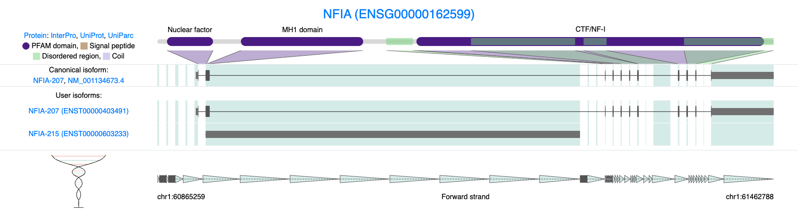

# **Profiling Isoform Diversity**

While traditional analyses—such as differential gene expression (DGE), differential isoform expression (DIE), or pseudotime trajectory inference—reveal important biological patterns, **long-read single-cell data** allow us to ask a different kind of question:

> **How is a gene’s expression distributed across its isoforms?**

This concept is what we refer to as **isoform diversity**.\
Rather than simply asking *“Is isoform X upregulated in cluster A?”*, we can instead explore:

-   Does a single cell rely on one dominant isoform for a given gene?

-   Or does it distribute expression more evenly across multiple isoforms?

-   And do cells of the same type agree on which isoforms they use—or is there variation even within a single population?

In the **FLAMESv2** framework, we formalize this idea using **Shannon’s entropy**, implemented through the `find_diversity()` function, to quantify isoform diversity at single-cell resolution.

In simple terms, **entropy** provides a numerical score describing how evenly a gene’s expression is split across its isoforms:

-   **Low entropy** → the gene primarily expresses a single isoform in that cell.

-   **High entropy** → the gene expresses multiple isoforms in roughly equal proportions.

```{r, fig.cap="Isoform diversity schematic. For each gene, we measure how transcript usage is distributed across isoforms within individual cells. Cells dominated by a single isoform show low isoform diversity (low entropy), while cells that express multiple isoforms at similar levels show high isoform diversity (high entropy).", out.width="1600px", fig.height=2, fig.width=5}
knitr::include_graphics("images/entropy_example.png")
```

## Measuring entropy with `find_diversity()` function

Let’s focus on the Radial Glial cells and explore the diversity of gene expression within individual cells.

In the FLAMESv2 software, we provide a dedicated function called `find_diversity()`. This function offers a simple way to calculate Shannon’s entropy for every gene in every cell, providing a quantitative measure of isoform or gene expression diversity. In FLAMESv2, This function is designed to operate on SingleCellExperiment (SCE) objects; however, in this tutorial we use a Seurat object. Therefore, the function has been appropriately modified to accept a Seurat object as input.

For detailed explanations of the parameters and outputs, please refer to the FLAMES Bioconductor manual.

In the following section, we will examine the diversity metrics across approximately 100 Radial Glial cells to illustrate this functionality in action.

We can load and run the function. It may take a while if you are processing many genes or many isofroms.

We will subset the object and run the diversity function

```{r, cache=TRUE, echo=TRUE}

#load diversity 

source("code/find_diversity.R")

# Subset to RG
RG_seu_obj <- subset(seu_obj , subset = sctype_db == "Radial glial cells")
DimPlot(RG_seu_obj, reduction = "umap")
DefaultAssay(RG_seu_obj) <- "RNA"
```

```{r, cache=TRUE, eval=FALSE, echo=TRUE}
#select genes we want to test. 
#In this case all genes
genes <- rownames(RG_seu_obj)

library(progressr)
handlers("txtprogressbar")

# Use with_progress and create progressor inside
res <- find_diversity(
    obj = RG_seu_obj,
    min_counts_per_cell = 10,
    assay = "iso",
    genes = genes
  )

## save file 
#saveRDS(res, "output_files/res.rds")
```

```{r, echo=TRUE}
# load res files 
res <- readRDS(file = "./output_files/res.rds")

dim(res$raw_entropy)
```

After running the diversity function, we identified 269 genes for which we could calculate isoform diversity metrics. By default, these tend to be highly expressed genes that are detected in at least 20% of cells. These parameters can be changed by the user, but because single-cell data are sparse we recommend being conservative. This helps make sure that each gene has enough counts per cell to accurately estimate diversity.

We can summarise these results in a heatmap. In this plot, each column is a single cell and each row is a gene that passed filtering. Grey regions indicate cell–gene combinations where there were not enough counts to calculate entropy for that gene in that cell.

```{r, echo=TRUE}
library(pheatmap)
pheatmap(res$normalized_entropy,
         show_rownames = FALSE,
         show_colnames = FALSE,
         cluster_rows = TRUE,
         cluster_cols = TRUE,
         main = "Entropy heatmap",
         na_col = "darkgrey", )
```

We can summarise these data by examining the top and bottom entropy genes—those showing the highest and lowest levels of isoform diversity across Radial Glial cells.

```{r, echo=TRUE}

library(ggplot2)
# Median entropy per gene
df <- data.frame(
  gene = rownames(res$normalized_entropy),
  median_entropy = apply(res$normalized_entropy, 1, median, na.rm = TRUE)
)

# Global median
global_median <- median(df$median_entropy, na.rm = TRUE)

#Select bottom 25 nonzero genes, always include VIM
df_nonzero <- df %>% dplyr::filter(median_entropy > 0 | gene == "VIM")
df_low <- df_nonzero %>%
  dplyr::mutate(median_entropy = as.numeric(median_entropy)) %>%
  dplyr::arrange(median_entropy) %>%
  dplyr::slice(1:25)


# Top 25 by highest median entropy
df_high <- df %>%
  dplyr::mutate(median_entropy = as.numeric(median_entropy)) %>%  # ensure it's numeric
  dplyr::arrange(desc(median_entropy)) %>%
  dplyr::slice(1:25)


# --- Low entropy plot (blue) with scale break ---
p_low <- ggplot(df_low, aes(x = median_entropy, y = reorder(gene, median_entropy), fill = median_entropy)) +
  geom_col() +
  geom_vline(xintercept = global_median, linetype = "dashed", color = "black") +
  scale_fill_gradient(low = "darkblue", high = "skyblue") +
  labs(x = "Median Normalised Entropy", y = "Low Entropy Genes") +
  theme_bw(base_size = 12) +
  theme(legend.position = "none")

# --- High entropy plot (red) ---
p_high <- ggplot(df_high, aes(x = median_entropy, y = reorder(gene, median_entropy), fill = median_entropy)) +
  geom_col() +
  geom_vline(xintercept = global_median, linetype = "dashed", color = "black") +
  scale_fill_gradient(low = "mistyrose", high = "firebrick") +
  labs(x = "Median Normalised Entropy", y = "High Entropy Genes") +
  theme_bw(base_size = 12) +
  theme(legend.position = "none")

p_high | p_low

```

Lets choose two genes to have a closer look at. We will choose one with low entropy - VIM, and one with high entropy NFIA. We can use some plotting functions to explore entropy in each cell and the expression of these isofroms for each gene. As you can see most cells for VIM show low entropy while cells expressing NFIA show comparatively high entropy.

```{r, echo=TRUE}
# Choose the genes we want to plot
genes <- c("VIM", "NFIA")

# Pull norm entropy and filter for genes we want
df_entropy <- res$normalized_entropy[genes, , drop = FALSE]

# Restructure the df  
df_long <- df_entropy %>%
  as.data.frame() %>%
  tibble::rownames_to_column("gene") %>%
  pivot_longer(
    cols = -gene,
    names_to = "cell",
    values_to = "entropy"
  )

# Add the cluster Identity 
df_long$sctype_db <- RG_seu_obj$sctype_db[df_long$cell]

library(ggplot2)
library(ggbeeswarm)

plot_entropy <- function(df, gene_name) {
  df_gene <- df %>% filter(gene == gene_name)

  med_val <- median(df_gene$entropy, na.rm = TRUE)

  ggplot(df_gene, aes(x = sctype_db, y = entropy)) +
    geom_quasirandom(alpha = 0.4, varwidth = TRUE) +
    stat_summary(fun = median, geom = "crossbar",
                 width = 0.6, fatten = 2, color = "red") +
    labs(
      title = paste0("Isoform entropy: ", gene_name),
      subtitle = paste0("Median = ", round(med_val, 3)),
      x = "Cell type",
      y = "Normalised Shannon entropy"
    ) +
    theme_minimal() +
    theme(
      axis.text.x = element_text(angle = 45, hjust = 1),
      plot.subtitle = element_text(color = "grey40")
    )
}

# Plot
p_VIM  <- plot_entropy(df_long, "VIM")
p_NFIA <- plot_entropy(df_long, "NFIA")

p_VIM | p_NFIA   
```

## Example of a low entropy gene

Let's look at VIM in a bit more detail. VIM is a simple in the sense that nearly all counts for these gene belong to the canonical isoform. We can plot this on a UMAP as shown bellow.

```{r, echo=TRUE}

# load Visualize fucntions 
# You can find the code on the github page or from the release which you can download - instructions on the first page 
source("code/plot_isoforms_exp_umap.R")
source("code/plot_isoform_entropy.R") 
source("code/plotIsoformPieCells.R") 

plot_isoforms_exp_umap(
  obj       = RG_seu_obj,
  gene      = "VIM",
  reduction = "umap",
  slot      = "data",
  assay = "iso",
  ncol = 2,
  n_features = 10 #,  # Optional: limit to top 5 isoforms
  #entropy_mat = res$normalized_entropy
)

```

We can also look at the proportion of isoform expression for VIM in each cell. As clearly shown bellow nearly all cells use a single isofroms.

```{r, echo=TRUE}
plotIsoformPieCells(seurat_obj = RG_seu_obj,
                    gene = "VIM",
                    assay = "iso",
                    slot = "counts",
                    top_n = 3,
                    n_cells = 12, # change this to plot more cells 
                    plot_col=4)


```

## Example of a high entropy gene

Let's contrast this to a gene with high entropy, NFIA. In this case NFIA is far more complex. Many cells show expression of multiple isofroms.

```{r, echo=TRUE}
plot_isoforms_exp_umap(
  obj       = RG_seu_obj,
  gene      = "NFIA",
  reduction = "umap",
  slot      = "data",
  assay = "iso",
  ncol = 2,
  n_features = 4 #,  # Optional: limit to top 4 isoforms
  #entropy_mat = res$normalized_entropy
)
```

The pie charts bellow show that, in contrast to VIM, cells expressing NFIA utilize at least two isoforms, often in nearly equal proportions. This pattern explains the high entropy observed for NFIA and suggests a more complex expression profile compared to a simpler, single-isoform gene like VIM.

Interestingly, there are numerous NFIA isoforms. The two most highly expressed isoforms shown here are quite distinct, as illustrated in the IsoVis plot below — one is protein-coding, containing critical functional domains, while the other represents a non-coding RNA variant.

```{r, echo=TRUE}

plotIsoformPieCells(seurat_obj = RG_seu_obj,
                    gene = "NFIA",
                    assay = "iso",
                    slot = "counts",
                    top_n = 5,
                    n_cells = 12,
                    plot_col=4)
```

Using IsoVis, we can further explore the structural differences between these isoforms and visualize how they contribute to transcriptomic complexity within individual cells.

```{r, fig.cap="Isoform diversity in NFIA (ENSG00000162599). Structural comparison of NFIA isoforms highlights the diversity of transcript usage detected in single-cell long-read data. The canonical and user-discovered isoforms differ markedly in exon structure and domain composition. One isoform encodes a full-length protein containing key functional domains (Nuclear factor, MH1, and CTF/NF-I), while another represents a non-coding or truncated transcript lacking these regions.", out.width="1600px", fig.height=2, fig.width=5}


```

By quantifying entropy at the single-cell level, we can distinguish simple genes - those dominated by one isoform, from complex genes that express multiple isoforms with variable expression across cells.

In the case of Radial Glial cells, this approach reveals a mixture of both expression modes: some genes like VIM exhibit low isoform diversity, consistent with stable structural roles, whereas others like NFIA show high entropy, reflecting more dynamic or context-dependent regulation.

## Broadening Entropy Analysis

For simplicity, in this example we explored isoform entropy in only a small subset of cells. However, this analysis can easily be expanded to include broader cell populations or even the entire dataset. Doing so enables more comprehensive, cell type–specific investigations, for example, assessing whether certain genes show different entropy levels across different cell types. Such comparisons can reveal important biological insights: some cell types may display low entropy, consistent with a simple and stable transcriptional program, while others—particularly more mature or specialized lineages may exhibit higher entropy, reflecting more complex isoform regulation and splicing diversity.
